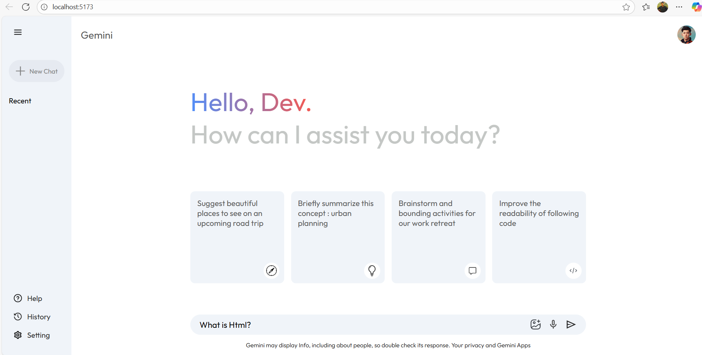

# Gemini-Clone

A simple AI-powered chat assistant inspired by Google’s Gemini, built with modern web technologies.

## Features

- Conversational AI chat interface
- Responsive and user-friendly design
- Integration with [your AI API or model]
- Built with [React / Node.js / etc.]

## Tech Stack

- Frontend: React.js (or your frontend tech)
- Backend: Node.js / Express (if applicable)
- AI: [Mention AI API or model used]

## Installation

1. Clone the repo:
   ```bash
   git clone https://github.com/Shravan-kumar-gupta/GeminiXpert.git

   ## Demo

